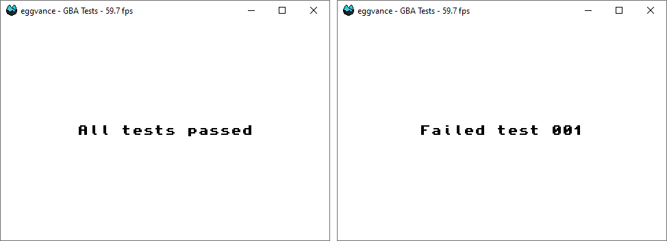

<<<<<<< HEAD
# GBA Tests
A collection of Game Boy Advance tests.

## Usage
Each ROM contains multiple tests. Either all of them pass or the number of the first failed one is displayed on the screen (background mode 4 is required). You can reference the source code for the expected result. Feel free to open an issue if something is unclear.

## Building
ROMs can be assembled with [FASMARM](https://arm.flatassembler.net/).
=======
# GBA Rustmulator

This is my attempt at developint an emulator for the GameBoy Advance:registered: completely in Rust.

## Status

**In Development**

At the moment the emulator is in working condition but no effort has been made to make it usable by the public. This is an experimental code base and therefore is provided as is.
>>>>>>> e56fe57 (Added Readme)
